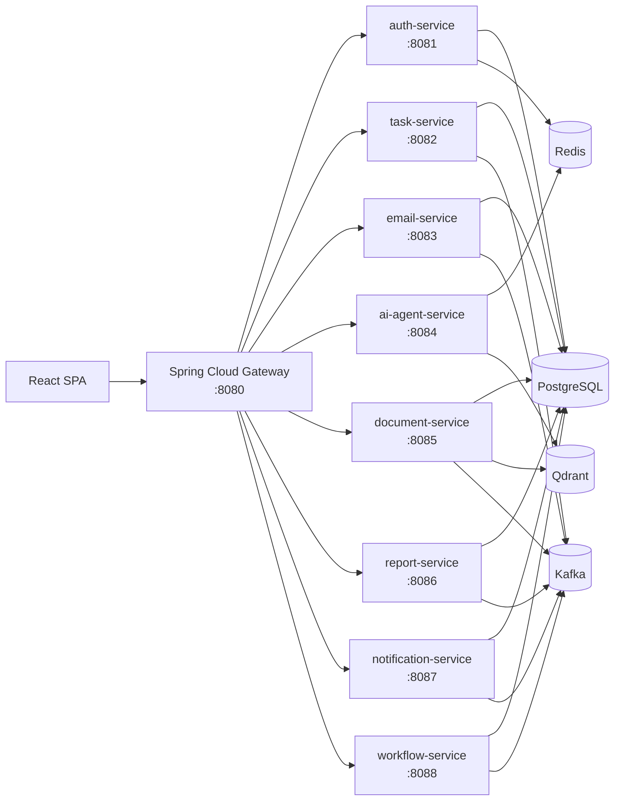

1) High-level architecture diagram (text/mermaid)



Architecture decisions:

| Decision | Choice | Rationale |
|---|---|---|
| Repository model | Maven multi-module monorepo | Single backend root keeps contracts, migrations, shared code, and service versioning aligned with the existing single frontend workspace. |
| Async backbone | Kafka | Better fit than RabbitMQ for durable auditability, replay, event fan-out, analytics backfills, and cross-service workflow orchestration. |
| Vector store | Qdrant | Strong fit for chunk metadata filtering, citations, and simple local Docker support. |
| Session/cache | Redis | Access token remains stateless JWT, while refresh token revocation, rate limiting, and short-lived AI cache belong in Redis. |

Sync vs async communication matrix:

| From | To | Mode | Purpose |
|---|---|---|---|
| Frontend | Gateway | Sync HTTP | All user-facing traffic |
| Gateway | Auth | Sync HTTP | Login, refresh, profile, settings |
| Gateway | Task | Sync HTTP | Task CRUD and board |
| Gateway | Email | Sync HTTP | Inbox, stats, task extraction trigger |
| Gateway | AI | Sync HTTP | Chat and attachment orchestration |
| Gateway | Document | Sync HTTP | Upload, retrieval, ask-document |
| Gateway | Report | Sync HTTP | Dashboard metrics, reports, health aggregation |
| Gateway | Notification | Sync HTTP | Notification inbox |
| Gateway | Workflow | Sync HTTP | Workflow and integration management |
| Email | Task | Async Kafka | Extracted tasks become candidate task creation events |
| Email | Notification | Async Kafka | New email-derived work alerts |
| Document | AI | Async Kafka + Qdrant | Embedding completion and RAG-ready status |
| Report | Notification | Async Kafka | Report ready notifications |
| Workflow | Notification | Async Kafka | Workflow state changes |

Gateway routes and auth filters:

| External path | Owner service | Auth requirement |
|---|---|---|
| `/auth/**`, `/users/**` | auth-service | `/auth/login` and `/auth/refresh` public, others bearer JWT |
| `/tasks/**` | task-service | bearer JWT |
| `/emails/**` | email-service | bearer JWT |
| `/ai/**` | ai-agent-service | bearer JWT |
| `/documents/**` | document-service | bearer JWT |
| `/reports/**`, `/dashboard/**`, `/health/services` | report-service | bearer JWT |
| `/notifications/**` | notification-service | bearer JWT |
| `/workflows/**`, `/integrations/**` | workflow-service | bearer JWT |

Failure handling strategy:

| Concern | Strategy |
|---|---|
| Sync timeout | Gateway timeout budget 3-5s for read APIs, 10s for report/document actions; return standard error envelope with traceId. |
| Retry | Client retries only idempotent GET; server-side retry for Kafka consumers with exponential backoff. |
| DLQ | Per-event DLQ topics such as `email.received.dlq` and `report.generated.dlq`. |
| Idempotency | `Idempotency-Key` header on write APIs, persisted to `idempotency_keys` with request hash. |
| Exactly-once boundary | Transactional outbox + Kafka producer idempotence, consumer dedupe by eventId and aggregate version. |
| Partial outage | Dashboard and notifications degrade independently; frontend shows card-level error states rather than page-level failure. |

2) Service responsibilities table

| Service | Core responsibility | Main endpoints | Data owned |
|---|---|---|---|
| gateway-service | Edge routing, centralized CORS, auth forwarding, observability entry point | routed only | route config, edge telemetry |
| auth-service | JWT auth, refresh rotation, profile and settings | `/auth/login`, `/auth/refresh`, `/auth/me`, `/users/me*` | users, roles, user_roles, refresh/revocation metadata |
| task-service | Task lifecycle, board projection, activity | `/tasks`, `/tasks/{id}`, `/tasks/board` | tasks, task_activity |
| email-service | Email ingestion, summarization, extraction trigger | `/emails`, `/emails/ingest`, `/emails/{id}/extract-tasks`, `/emails/stats` | emails, extracted_tasks |
| ai-agent-service | Chat, summarization, drafting, task extraction orchestration | `/ai/chat`, `/ai/chats`, `/ai/chats/{id}/messages`, `/ai/chats/{id}/attachments` | chat sessions, transient prompt cache |
| document-service | Upload, chunking, embedding orchestration, cited Q&A | `/documents/upload`, `/documents/{id}/ask`, `/documents/{id}/chunks` | documents, document_chunks, vector ids |
| report-service | Report generation, analytics, dashboard aggregates, service health view | `/dashboard/*`, `/reports*`, `/health/services` | reports, analytics snapshots |
| notification-service | Inbox, read-state, dispatch tracking | `/notifications*` | notifications |
| workflow-service | Automation definitions, execution history, integration connect/disconnect | `/workflows*`, `/integrations*` | integrations, workflow definitions, execution logs |

3) DB schema DDL

Canonical DDL lives in [backend/db-migrations/src/main/resources/db/migration/V1__initial_schema.sql](backend/db-migrations/src/main/resources/db/migration/V1__initial_schema.sql) and seed data in [backend/db-migrations/src/main/resources/db/migration/V2__seed_data.sql](backend/db-migrations/src/main/resources/db/migration/V2__seed_data.sql).

Index and constraint strategy:

| Table | Primary constraints and indexes |
|---|---|
| users | unique `email`, index `idx_users_email` |
| roles | unique `code` |
| user_roles | composite primary key `(user_id, role_id)` |
| tasks | foreign keys to users/emails, indexes on `(assignee_user_id, status)` and `due_at` |
| task_activity | index `(task_id, created_at desc)` |
| emails | unique `external_email_id`, index on `received_at` |
| extracted_tasks | FK to `emails`, index on `email_id` |
| documents | owner/date index |
| document_chunks | unique `(document_id, chunk_index)` and retrieval index |
| reports | owner/status index |
| notifications | user/read index |
| integrations | unique `(user_id, provider)` |
| audit_logs | traceId lookup index |
| idempotency_keys | unique `idempotency_key` |
| outbox_events | status/created index for publisher scan |

Migration approach:

| Tool | Use |
|---|---|
| Flyway | Versioned schema and seed migrations from the backend root |
| Script | `backend/scripts/migrate.ps1` |
| Maven module | `db-migrations` with Flyway Maven plugin |

4) OpenAPI-like endpoint specs

Unified response envelope:

```json
{
  "timestamp": "2026-03-17T09:12:00Z",
  "traceId": "b2536f7a-6fa9-4b10-9b92-fdb2f0be4bdb",
  "data": {},
  "error": null
}
```

Standard error envelope:

```json
{
  "timestamp": "2026-03-17T09:12:00Z",
  "traceId": "b2536f7a-6fa9-4b10-9b92-fdb2f0be4bdb",
  "data": null,
  "error": {
    "code": "VALIDATION_ERROR",
    "message": "Request validation failed",
    "details": ["email: must be a well-formed email address"]
  }
}
```

Pagination/filter/sort standard:

| Query param | Meaning |
|---|---|
| `page` | zero-based page index |
| `size` | page size, default 20, max 100 |
| `sort` | `field` or `field,DESC` depending on endpoint |
| resource filters | endpoint specific, for example `status`, `priority`, `provider` |

Auth service:

| Endpoint | Request schema | Validation | Response |
|---|---|---|---|
| `POST /auth/login` | `{ email, password }` | email format, password required | `LoginResponse` |
| `POST /auth/refresh` | `{ refreshToken }` | token required | rotated `LoginResponse` |
| `POST /auth/logout` | `{ refreshToken }` | token required | `{ status: "revoked" }` |
| `GET /auth/me` | bearer JWT | authenticated | `UserProfile` |
| `GET /users/me` | bearer JWT | authenticated | `UserProfile` |
| `PATCH /users/me` | `{ firstName, lastName }` | non-blank | updated `UserProfile` |
| `PATCH /users/me/password` | `{ currentPassword, newPassword }` | new password 12-72 chars with upper/lower/digit/symbol | `{ status: "updated" }` |
| `PATCH /users/me/preferences` | `{ preferences: Record<string,string> }` | object required | updated `UserProfile` |
| `POST /users/me/2fa/enable` | `{ method }` | non-blank | `{ status, method }` |

Task service:

| Endpoint | Request schema | Validation | Idempotency |
|---|---|---|---|
| `GET /tasks` | query `page,size,status,priority,sort` | size bounded | n/a |
| `POST /tasks` | `{ title, description, assigneeUserId, priority, dueAt, source }` | title required | supported via `Idempotency-Key` |
| `PATCH /tasks/{id}` | partial task update | valid enum values | optional |
| `DELETE /tasks/{id}` | none | existing task id | safe repeat delete |
| `GET /tasks/board` | none | none | n/a |

Email service:

| Endpoint | Request schema | Validation | Response |
|---|---|---|---|
| `GET /emails` | query `page,size` | size bounded | paged `EmailItem` list |
| `GET /emails/{id}` | path id | must exist | `EmailItem` |
| `POST /emails/ingest` | `{ senderName, senderEmail, subject, aiSummary, priority, receivedAt }` | senderEmail + subject required | ingested `EmailItem` |
| `POST /emails/{id}/extract-tasks` | none | email must exist | extracted task suggestions with confidence |
| `GET /emails/stats` | none | none | metrics object |

AI service:

| Endpoint | Request schema | Validation | Response |
|---|---|---|---|
| `POST /ai/chat` | `{ chatId?, prompt, mode, attachments[] }` | prompt required | `ChatReply` |
| `GET /ai/chats` | none | none | chat summaries |
| `GET /ai/chats/{id}/messages` | path id | chat must exist | message list |
| `POST /ai/chats/{id}/attachments` | `{ fileName, contentType, size, metadata }` | fileName and contentType required | attachment receipt |

Document service:

| Endpoint | Request schema | Validation | Response |
|---|---|---|---|
| `POST /documents/upload` | multipart form-data `file`, optional `ownerUserId` | file required | uploaded `DocumentItem` |
| `GET /documents` | query `page,size` | size bounded | paged documents |
| `GET /documents/{id}` | path id | document must exist | `DocumentItem` |
| `POST /documents/{id}/ask` | `{ question }` | question required | `DocumentAnswer` with citations |
| `GET /documents/{id}/chunks` | path id | document must exist | chunk list |

Report service:

| Endpoint | Request schema | Validation | Response |
|---|---|---|---|
| `GET /dashboard/metrics` | none | none | dashboard KPIs |
| `GET /dashboard/activity` | none | none | recent activity feed |
| `GET /health/services` | none | none | downstream health cards |
| `GET /reports` | query `page,size` | size bounded | paged reports |
| `POST /reports/generate` | `{ reportType, title, parameters }` | type/title required | requested `ReportItem` |
| `GET /reports/{id}` | path id | report must exist | `ReportItem` |
| `GET /reports/analytics` | none | none | chart-ready analytics payload |

Notification service:

| Endpoint | Request schema | Validation | Response |
|---|---|---|---|
| `GET /notifications` | query `page,size` | size bounded | paged notifications |
| `GET /notifications/recent` | none | none | top 5 notifications |
| `PATCH /notifications/{id}/read` | none | id exists | updated notification |
| `PATCH /notifications/read-all` | none | none | `{ status: "all-read" }` |
| `DELETE /notifications/{id}` | none | id exists | `{ status: "deleted" }` |

Workflow and integrations:

| Endpoint | Request schema | Validation | Response |
|---|---|---|---|
| `GET /workflows` | none | none | workflow list |
| `POST /workflows` | `{ name, steps[] }` | name required | created workflow |
| `PATCH /workflows/{id}/status` | `{ status }` | status required | updated workflow |
| `GET /workflows/{id}/executions` | path id | workflow exists | execution history |
| `GET /integrations` | none | none | integration cards |
| `POST /integrations/{provider}/connect` | provider-specific config body | provider required | connected integration |
| `POST /integrations/{provider}/disconnect` | none | provider required | disconnected integration |
| `POST /integrations/webhooks/{provider}` | provider event payload | provider required | accepted receipt |

Endpoint authorization matrix:

| Endpoint family | ADMIN | EMPLOYEE |
|---|---|---|
| `/auth/**` | login/refresh public, me allowed | login/refresh public, me allowed |
| `/users/me*` | allowed | allowed |
| `/tasks/**` | full CRUD | full CRUD on assigned/self-visible tasks |
| `/emails/**` | full access | full access to scoped inbox |
| `/documents/**` | full access | upload/read/ask allowed |
| `/reports/**` | generate + analytics + org reports | personal/team-scoped report access |
| `/notifications/**` | allowed | allowed |
| `/workflows/**` | create/change status allowed | read allowed, execution view allowed |
| `/integrations/**` | org integrations allowed | personal integration connect/disconnect allowed |

Security model:

| Concern | Design |
|---|---|
| Password hashing | BCrypt with strong work factor |
| Password rules | minimum 12 chars, upper/lower/digit/symbol |
| Access token | JWT, 15 minutes |
| Refresh token | JWT, 14 days, rotated on refresh |
| Revocation | refresh and current access token JTIs tracked in Redis/in-memory fallback |
| CORS | allow SPA dev origins and production UI domain only |
| CSRF | disabled for stateless bearer-token SPA |

5) Event catalog

| Event name | Producer | Consumers | Payload example | Retry and idempotency |
|---|---|---|---|---|
| `email.received` | email-service | workflow-service, notification-service, ai-agent-service | `{ "eventId":"...", "correlationId":"...", "emailId":"email-101", "sender":"sarah.j@client.com", "receivedAt":"2026-03-17T08:00:00Z" }` | consumer dedupe by `eventId`, retry 3x with exponential backoff, then DLQ |
| `email.tasks.extracted` | email-service | task-service, notification-service | `{ "emailId":"email-101", "tasks":[{"title":"Review Q1 budget","confidence":0.94}] }` | task creation checks idempotency key derived from emailId + title |
| `task.created` | task-service | notification-service, report-service | `{ "taskId":"task-1", "assigneeUserId":"...", "priority":"HIGH" }` | transactional outbox publish |
| `task.updated` | task-service | notification-service, report-service | `{ "taskId":"task-1", "status":"COMPLETED" }` | consumer updates by aggregate version |
| `document.uploaded` | document-service | workflow-service, ai-agent-service | `{ "documentId":"doc-1", "fileName":"Annual_Report_2024.pdf" }` | duplicate uploads resolved by content hash |
| `document.embedded` | document-service | ai-agent-service | `{ "documentId":"doc-1", "collection":"enterprise-docs", "chunkCount":14 }` | exactly-once via outbox + vector id uniqueness |
| `report.generation.requested` | report-service | workflow-service, notification-service | `{ "reportId":"report-1", "reportType":"WEEKLY_PRODUCTIVITY" }` | idempotency key per report request |
| `report.generated` | report-service | notification-service | `{ "reportId":"report-1", "status":"GENERATED" }` | ignore duplicate terminal updates |
| `notification.dispatch.requested` | task/email/report/workflow services | notification-service | `{ "notificationType":"TASK_CREATED", "userId":"..." }` | dedupe on eventId |
| `notification.dispatched` | notification-service | report-service | `{ "notificationId":"note-1", "channel":"IN_APP", "status":"SENT" }` | update only if state not terminal |

Correlation ID propagation:

- Gateway generates or forwards `X-Trace-Id`.
- Services copy the trace ID into logs, Kafka headers, audit logs, and error envelopes.
- Event payloads also include `correlationId` and `eventId`.

Exactly-once/idempotent processing strategy:

- Outbox table write occurs in the same transaction as business state change.
- Kafka producer uses idempotence enabled.
- Consumer stores processed `eventId` for bounded dedupe window.
- Write APIs persist `Idempotency-Key` and request hash.

6) Frontend mapping matrix

| Frontend route | UI widgets/data blocks | API endpoints | Service owner | Event dependencies | Polling/WebSocket/SSE strategy | Expected loading/error behavior |
|---|---|---|---|---|---|---|
| `/login` | login form, remember-me, session bootstrap | `POST /auth/login`, `POST /auth/refresh`, `GET /auth/me` | auth-service | none | none | inline field errors, disable submit while authenticating |
| `/` | metrics cards, activity feed, AI insights, recent notifications, health card | `GET /dashboard/metrics`, `GET /dashboard/activity`, `GET /notifications/recent`, `GET /health/services` | report-service + notification-service | `task.created`, `report.generated`, `notification.dispatched` | poll notifications every 30s | card skeletons, partial-card retry, no global hard fail |
| `/ai-assistant` | chat history, conversation, prompt suggestions, attachment action | `POST /ai/chat`, `GET /ai/chats`, `GET /ai/chats/{id}/messages`, `POST /ai/chats/{id}/attachments` | ai-agent-service | `document.embedded`, `email.tasks.extracted` | request-response now, SSE later for streamed tokens | message send optimistic bubble, retry toast on fail |
| `/email-automation` | summary cards, email table, detail preview | `GET /emails`, `GET /emails/{id}`, `POST /emails/ingest`, `POST /emails/{id}/extract-tasks`, `GET /emails/stats` | email-service | `email.received`, `email.tasks.extracted` | poll stats and inbox every 60s | table skeleton, preserve old data on refresh error |
| `/tasks` | task table, create modal, status badges, kanban board | `GET /tasks`, `POST /tasks`, `PATCH /tasks/{id}`, `DELETE /tasks/{id}`, `GET /tasks/board` | task-service | `task.created`, `task.updated`, `email.tasks.extracted` | no polling required, manual refresh or local cache invalidation | optimistic create/update/delete with rollback on failure |
| `/documents` | upload CTA, document cards, viewer, ask-AI panel | `POST /documents/upload`, `GET /documents`, `GET /documents/{id}`, `POST /documents/{id}/ask`, `GET /documents/{id}/chunks` | document-service | `document.uploaded`, `document.embedded` | poll processing status every 15s until ready | upload progress, disable ask until ready, citation warning if low confidence |
| `/reports` | chart widgets, generate report button, report preview | `GET /reports`, `POST /reports/generate`, `GET /reports/{id}`, `GET /reports/analytics` | report-service | `report.generation.requested`, `report.generated` | poll requested reports every 20s | chart placeholders, queued badge while generating |
| `/notifications` | filters, list, mark-read, clear/delete | `GET /notifications`, `PATCH /notifications/{id}/read`, `PATCH /notifications/read-all`, `DELETE /notifications/{id}` | notification-service | `notification.dispatch.requested`, `notification.dispatched` | poll every 30s, future SSE | update badge count immediately, reconcile on next poll |
| `/workflow-automation` | workflow cards, node flow, create workflow CTA | `GET /workflows`, `POST /workflows`, `PATCH /workflows/{id}/status`, `GET /workflows/{id}/executions` | workflow-service | `email.received`, `task.created`, `report.generated` | manual refresh for executions | keep list visible if one workflow fails to load details |
| `/integrations` | provider cards, status indicator, connect/disconnect | `GET /integrations`, `POST /integrations/{provider}/connect`, `POST /integrations/{provider}/disconnect`, `POST /integrations/webhooks/{provider}` | workflow-service | provider webhooks drive downstream events | no polling, refresh after action and webhook receipt | provider-specific error surface near card |
| `/settings` | profile form, password change, preferences, 2FA | `GET /users/me`, `PATCH /users/me`, `PATCH /users/me/password`, `PATCH /users/me/preferences`, `POST /users/me/2fa/enable` | auth-service | none | none | inline validation and per-section save state |

DTO naming conventions:

- Request DTOs end in `Request`.
- Write responses use resource names like `TaskItem`, `ReportItem`, `DocumentItem`.
- Page responses always wrap `PageEnvelope<T>`.
- Frontend model names mirror backend DTO names exactly to reduce transform code.

Auth interceptor behavior:

- Attach bearer token from local storage to every request except login/refresh.
- On first 401, issue a single refresh request and queue concurrent retries behind the same promise.
- If refresh fails, clear local tokens and redirect to `/login`.

7) Implementation phases (Phase 1 to Phase 6)

| Phase | Scope |
|---|---|
| Phase 1 | Shared platform module, Flyway schema, Docker Compose dependencies, gateway routing |
| Phase 2 | Auth service, JWT rotation, profile/settings APIs, frontend auth client wiring |
| Phase 3 | Task, email, notification services with synchronous route integration |
| Phase 4 | Document + AI agent services, RAG orchestration, attachment handling |
| Phase 5 | Reports, workflow orchestration, Kafka events, outbox/idempotency hardening |
| Phase 6 | Contract tests, Testcontainers integration tests, observability, rate limiting, production deployment configs |

8) Definition of Done checklist

- All listed frontend routes have owned backend endpoints.
- Every service exposes Swagger/OpenAPI.
- Gateway routes resolve exact frontend paths through a single entry point.
- Flyway migrations create all required relational tables and indexes.
- JWT login, refresh, logout, and `/auth/me` are functional.
- Error envelope is consistent across services with `traceId`.
- `Idempotency-Key` is supported on write APIs that can be retried by clients.
- Docker Compose brings up PostgreSQL, Redis, Kafka, Qdrant, and Kafka UI.
- Frontend has typed API contracts and an auth-aware client.
- Backend root contains scripts for run, test, migrate, and seed.

9) Risks and mitigations

| Risk | Impact | Mitigation |
|---|---|---|
| JWT revocation only in memory for current scaffold | restart loses revocation state | move revocation keys to Redis before production rollout |
| Current services are contract-first and in-memory for business state | state is not durable yet | replace controller-held maps with repositories/service layers backed by PostgreSQL in next iteration |
| RAG pipeline not yet calling embedding model | answers are deterministic scaffold responses | add embedding worker, Qdrant collection bootstrap, and citation scoring service |
| No streaming AI output yet | assistant UX is non-streaming | add SSE endpoint in ai-agent-service and streaming renderer in frontend |
| Gateway auth is route-based, not token introspection-based | limited edge enforcement | add gateway token verification filter once central key management is finalized |

10) Next 14-day execution plan with daily milestones

| Day | Milestone |
|---|---|
| Day 1 | Bring up Docker Compose, run Flyway, verify local ports and gateway routing |
| Day 2 | Replace auth in-memory user store with PostgreSQL + Redis refresh token revocation |
| Day 3 | Add task persistence, task_activity writes, and task contract tests |
| Day 4 | Add email persistence, ingestion worker, and extracted-task approval flow |
| Day 5 | Publish Kafka events through outbox for email and task services |
| Day 6 | Add notification dispatch worker and read-model projections |
| Day 7 | Implement document text extraction and Qdrant collection bootstrap |
| Day 8 | Add embedding generation worker and cited retrieval queries |
| Day 9 | Connect ai-agent-service to LLM provider with prompt guardrails and Redis cache |
| Day 10 | Add report generation jobs, analytics aggregation, and dashboard query optimization |
| Day 11 | Implement workflow execution persistence and execution audit logs |
| Day 12 | Add Testcontainers integration tests for auth, tasks, and documents |
| Day 13 | Add structured logging, Micrometer metrics, rate limiting, and readiness checks |
| Day 14 | Run e2e smoke path from login through dashboard, tasks, documents, and reports |

AI/RAG implementation notes:

| Capability | Design |
|---|---|
| Chat | retrieval-augmented chat with user/session context and citations when document context exists |
| Summarize | system prompt constrains output to grounded summaries with bullet sections |
| Task extraction | function-style JSON response with confidence threshold and schema validation |
| Report drafting | template-driven prompt with business metrics injected from report-service |
| Guardrails | PII redaction, tool allow-list, citation requirement for knowledge answers, low-confidence fallback |
| Hallucination mitigation | answer only from retrieved chunks for document Q&A, attach confidence score and citations, fall back to "insufficient evidence" |
| Cost control | cache prompt+context hash in Redis, chunk retrieval cap, prompt compression, async batch embeddings |

Non-functional requirements summary:

- Structured JSON logging with `traceId` and `spanId`.
- Micrometer + Prometheus metrics.
- `/actuator/health` readiness/liveness exposure per service.
- API versioning at gateway path level when breaking changes begin, for example `/v1/tasks`.
- Unit tests for controller/service logic, Testcontainers for integration, contract tests for frontend DTO compatibility, smoke e2e through gateway.